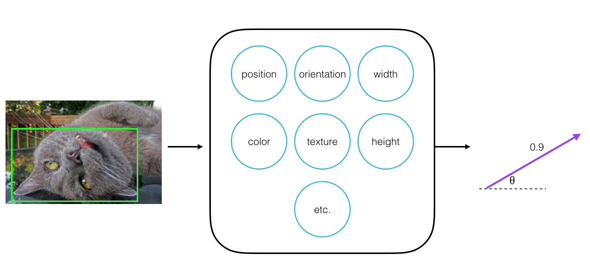
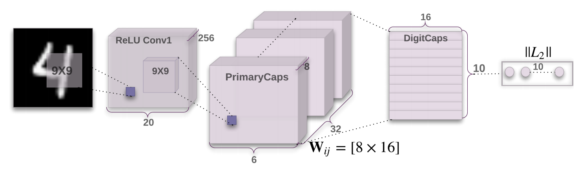

# Capsule Network

Readable implementation of a Capsule Network as described in "Dynamic Routing Between Capsules" [Hinton et. al.]

In this notebook, I'll be building a simple Capsule Network that aims to classify MNIST images. 
This is an implementation in PyTorch and this notebook assumes that you are already familiar with [convolutional and fully-connected layers](https://cezannec.github.io/Convolutional_Neural_Networks/). 

### What are Capsules?

Capsules are a small group of neurons that have a few key traits:
* Each neuron in a capsule represents various properties of a particular image part; properties like a parts color, width, etc.
* Every capsule **outputs a vector**, which has some magnitude (that represents a part's **existence**) and orientation (that represents a part's generalized pose).
* A capsule network is made of multiple layers of capsules; during training, this network aims to learn the spatial relationships between the parts and whole of an object (ex. how the position of eyes and a nose relate to the position of a whole face in an image).
* Capsules represent relationships between parts of a whole object by using **dynamic routing** to weight the connections between one layer of capsules and the next and creating strong connections between spatially-related object parts.

  

You can read more about all of these traits in [my blog post about capsules and dynamic routing](https://cezannec.github.io/Capsule_Networks/).

### Representing Relationships Between Parts

All of these traits allow capsules to communicate with each other and determine how data moves through them. 
Using dynamic communication, during the training process, a capsule network learns the **spatial relationships** between visual parts and their wholes (ex. between eyes, a nose, and a mouth on a face).
When compared to a vanilla CNN, this knowledge about spatial relationships makes it easier for a capsule network to identify an object no matter what orientation it is in. 
These networks are also, generally, better able to identify multiple, overlapping objects, and to learn from smaller sets of training data! 

---
## Model Architecture

The Capsule Network that I'll define is made of two main parts:
1. A convolutional encoder
2. A fully-connected, linear decoder

  

The above image was taken from the original [Capsule Network paper (Hinton et. al.)](https://arxiv.org/pdf/1710.09829.pdf). The notebook follows the architecture described in that paper and tries to replicate some of the experiments, such as feature visualization, that the authors pursued. 

---
## Running Code Locally

If you're interested in running this code on your own computer, there are thorough instructions on setting up anaconda, and downloading PyTorch and the necessary libraries in the [readme of Udacity's deep learning repo](https://github.com/udacity/deep-learning-v2-pytorch/blob/master/README.md). After downloading the necessary libraries, you can proceed with cloning and running this code, as usual.
